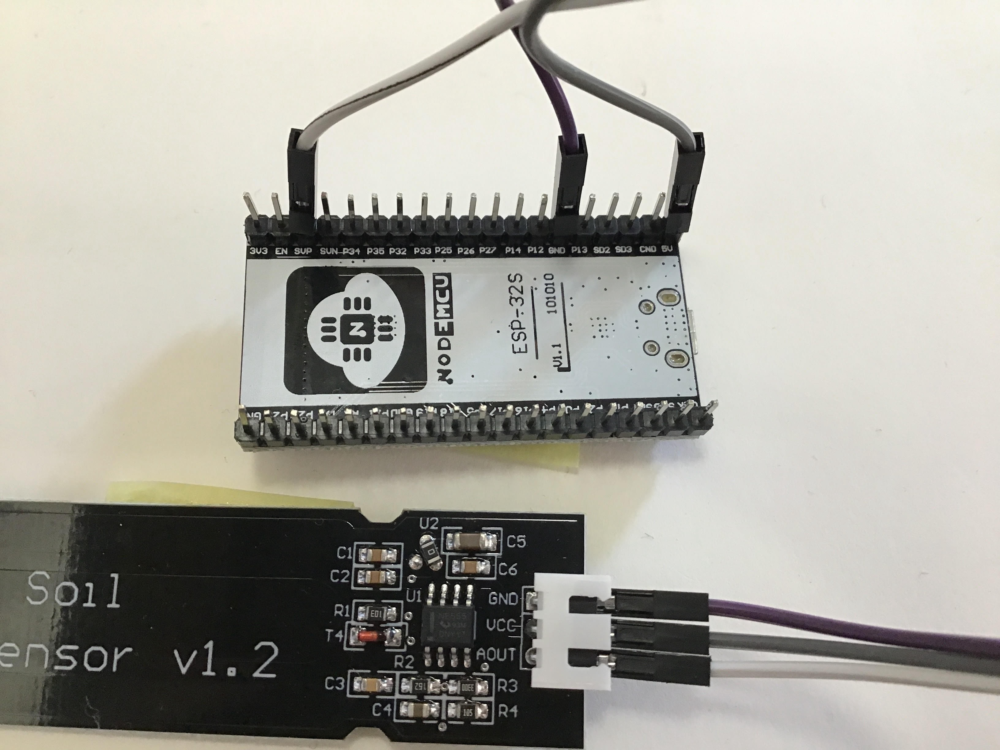

# Create a moisure sensor with ESP32. 


## Goal

* Create a moisture sensor for a flower pot
* with ESP32
* with WiFi
* Send an e-mail when the flower pot is too dry.


## Overview

We start creating development environment.

1. Prepare tools
* Install VS code
* Add Platform IO extention to VS code
* Create a new project

2. Code to measure threshould (without e-mail part)
* Write measure_threshold.cpp
* Build and upload the code to ESP32
* Measure the threshould

3. Test deep sleep
* Write mosture_deepsleep.cpp
* With deep sleep function
* Measure voltage decline
* Build and upload the code

4. E-mail part
* Create new gmail account for ESP32
* Credential?
* Write the code again with e-mail part
* Build and upload the code
* Test it


---
## Prepare development environment

### VS code
[Instruction](https://code.visualstudio.com/download)

### PlatformIO

PlatformIO replaces Arduino IDE.
[Instruction](https://platformio.org/install/ide?install=vscode)

* Create a new project.


* Pick 'NodeMCU ESP-32S' which we are going to use below. 


Your directoy should now look like
```
.
├── LICENSE
├── README.md
├── include
│   └── README
├── lib
│   └── README
├── platformio.ini
├── src
│   └── main.cpp
└── test
    └── README
```
We will work with ```main.cpp```.

---
## Measure threshold

### Prepare hardware

* NodeMCU ESP-32S
* Capacitive Soil Moisture Sensor v1.2



Conenct ESP32 board to your laptop with USB mini cable.


__NOTE__

Checked 3.3V input with a __photoresistor__ to understand how a sensor that assumes
5V input to V_CC works when the input is 3.3V. 


|      | Bright | Neutral | Dark |     | 
|----  |  ----  |   ----  | ---- | ----| 
|3.3V  |  0.05  | 0.8     | 3.3  | [V] |
|5.0V  |  0.07  | 1.1     | 4.7  |     |
|----  |  ----  |   ----  | ---- | ----| 
|3.3V  |  0     | 840     | 4095 | [ADU] |
|5.0V  |  0     | 1280    | 4095 |     | 
|----  |  ----  |   ----  | ---- | ----|

It looks indeed the dynamic range is smaller for 3.3V input
(the bright end will saturate faster), but working fine.

For the safety of GPIO input (it works with 5V input, but the
specification is 3.3V), let us use 3.3V input.


### Code
An example source code is in ```./src/1```.

Make sure ```src_dir``` of ```./platformio.ini``` points to ```./src/1```

```
[env:nodemcu-32s]
platform = espressif32
board = nodemcu-32s
framework = arduino
src_dir = "src/1"
````

Make sure there is no ```main.cpp``` directly under ```./src```

```
$ tree ./src
./src
└── 1
    └── main.cpp
```

### Build

* Set the name of your WiFi network in ```main.cpp```
* Set the password of your WiFi network in ```main.cpp```. Usually the password is a long digits (=numbers).
* Build using __dropdown menu__, instead of arrow button. 


### Upload
* Upload using __dropdown menu__.


### Open serial monitor

To check IP address of ESP32.
The port must be ```/dev/tty.SLAB_USBtoUART```.
As you see the IP address in our case is 192.168.178.154.


### Test

If the code and the hardware are working well, we should see ...

```
$ curl 192.168.178.154
<!DOCTYPE html>
<html><body style='font-family: sans-serif'><p>
4095
</body></html>
HTTP/1.1 200 OK
```

### Measure threshould

* Prepare a flower pot with completely dried soil
* Stick moisture sensor to the soil
* Keep reading the output with ```curl```
* Pour water in the flower pot slowly.
* Not the output reading when you think that is the border between dry and wet.

---
## Deep Sleep

EPS32 has a deep sleep mode were ULP (ultra lower power co-processor) is
running (main CPU and network are off). In the deep sleep mode, the
current is supposed to be 10-150 micro A.

We will rewrite the code to implement

* modem sleep / light sleep / deep sleep 
* hibernation
* monitor current

The code is in ```./src/2```. Pleaes edit ```platformio.ini``` like this.
```
[env:nodemcu-32s]
platform = espressif32
board = nodemcu-32s
framework = arduino
src_dir = "src/1"

```


### 


---
# END